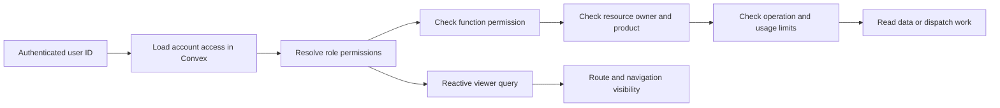

# Scout access-control research

The [current RFC](./access-control-rfc.md) and [approval follow-up](./account-approval-research.md) supersede this document’s earlier recommendation to keep signup closed.

Status: research and earlier options, September 6, 2026. The [first-stage RFC](./access-control-rfc.md) is the current implementation contract. Resource scopes, Scout allocation, organizations, and product-specific threads discussed here are deferred; they are not part of the approved account foundation.

Scout baseline: `1947f4586154d0b6866b4e229937fe1b2f636a95`. Samebase reference: `be38438b9aafe08fe320f4ee97c871c031498022`. Findings below describe those local checkouts, not a production database audit.

Use two account roles, `role_member` and `role_admin`. Each role grants named permissions. Public Convex functions and frontend routes check those permissions. Resource checks separately decide which session, browser, or Scout the account may use.

The initial product direction is admin-only Lab and member access to Scout Play and Scout Review. Play must first stop using unrestricted Lab contracts. Review currently has a public landing page, so this RFC reserves its permission without inventing a review workflow.

The smallest useful first implementation is the shared access model, stored role assignments, mandatory backend guards, and reactive route guards. Keep the existing admission restriction through that work. Opening member access is a later release step that depends on product and provider isolation.

## What Samebase establishes

Samebase provides a strong architectural precedent, but its older RFC is not a complete description of its current code.

| Evidence                                                                     | Verified behavior                                                                                                                                         | Decision for Scout                                                                                            |
| ---------------------------------------------------------------------------- | --------------------------------------------------------------------------------------------------------------------------------------------------------- | ------------------------------------------------------------------------------------------------------------- |
| [Access model RFC 085][samebase-rfc], [current shared model][samebase-model] | Roles bundle `access_*` keys. Consumers check effective keys through `canAccess`.                                                                         | Adopt this vocabulary and one shared grants map.                                                              |
| [Public function builders][samebase-functions]                               | App-owned query, mutation, and action builders require a declared access key and resolve `ctx.viewer`. Actions load the viewer through an internal query. | Adopt mandatory policy declarations using the already installed `convex-helpers`.                             |
| [Viewer projection][samebase-viewer], [route boundary][samebase-routes]      | `users.currentViewerAccess` supplies effective access; routes wait for that result before rendering restricted content.                                   | Adopt one reactive viewer query for routes and navigation.                                                    |
| [Viewer role resolution][samebase-role]                                      | Staff comes from a hardcoded email list; approval and account lifecycle affect derived roles.                                                             | Persist Scout role assignments against user IDs. Keep admission and account status separate from roles.       |
| [Organization access checks][samebase-org-access]                            | Organization membership and owner checks are additional conditions. Staff has no automatic membership bypass.                                             | Preserve resource ownership even for admins. Defer organizations until there is a team-sharing requirement.   |
| [Members implementation][samebase-members]                                   | Role changes check the actor, the target membership, and another active owner in the same mutation.                                                       | Apply the same transaction pattern to promotions, demotions, and suspension, including last-admin protection. |
| [WorkOS research][samebase-workos]                                           | Permissions are the stable application contract. External resource checks would need a strategy compatible with Convex reads.                             | Keep authority in Convex. No new identity provider or remote permission service is needed for this change.    |

Two discrepancies matter. RFC 085 still contains examples granting members file read/write access, while its summary and the current grants map omit those permissions. Its earlier personal-vault model also predates current organization ownership. Spec 123 says role changes are not blocked by active work, but current organization access code additionally protects designated billing payers and pending payer transfers. Use current code for these details, not isolated paragraphs from the older documents. Scout does not need those billing rules. [RFC 085][samebase-rfc], [current grants][samebase-model], [spec 123][samebase-members-spec], [current organization checks][samebase-org-access].

I also searched recent and archived Codex tasks. The retrieved **Research organization Members page** discussions show a useful correction: a missing user and a deliberately deleted user should not be silently treated as the same state. That supports explicit account availability checks, but does not justify adding Samebase's whole deletion workflow to Scout. The later task reports its Members work merged through PR #1418. Task history is context; the checkout remains the implementation evidence. [Lifecycle discussion][members-lifecycle-task], [later Members task][members-shipped-task].

Current primary sources support these choices. WorkOS defines roles as permission bundles, and OWASP recommends default denial, checks on every request, and relationship checks for resource access. Convex documents custom function builders for shared authorization logic. These are design references, not a recommendation to replace Convex Auth. [WorkOS roles][workos], [OWASP authorization][owasp], [Convex custom functions][custom-functions].

## Scout's current boundaries

| Area               | Current implementation                                                                                                                                     | Consequence for member access                                                                                                                 |
| ------------------ | ---------------------------------------------------------------------------------------------------------------------------------------------------------- | --------------------------------------------------------------------------------------------------------------------------------------------- |
| Sign-in and signup | Password authentication supports verification and reset, but `ADMIN_ONLY = true` restricts admitted emails. `requireAppUser` repeats that admission check. | There is no stored member/admin model. Removing the allowlist alone broadens every existing admitted-user API.                                |
| Chats              | `scoutChats` stores `userId` and `scoutId`; handlers check the Agent thread owner.                                                                         | Useful ownership protection already exists. Preserve both binding and Agent metadata checks.                                                  |
| Scout inventory    | `scouts` has no user or product ownership. `scouts.list/get` accept any admitted user. `createThread` accepts any active Scout ID.                         | A private chat can still operate a shared browser profile, inbox, and saved accounts. Private chat ownership does not isolate provider state. |
| Play               | `/play/session` calls `scouts.list`, `chats.createThread`, `sendMessage`, `listThreads`, browser queries, and handoff queries.                             | Product routing is presentation only. The database cannot distinguish Play from Lab.                                                          |
| Review             | `/review` is a static preview whose button opens `/chats`.                                                                                                 | Members need a truthful preview state until a dedicated workflow exists. Lab cannot serve as the member fallback.                             |
| Lab diagnostics    | Manual tools, runtime instructions, model-call snapshots, browser operations, and replay actions check admission and/or thread ownership.                  | They need an explicit Lab permission, including calls made directly without the UI.                                                           |
| Human handoff      | Access can come from the owning signed-in user or an expiring bearer token.                                                                                | This is a deliberate delegated permission, separate from account roles. A blanket login wrapper would break the emailed-link flow.            |
| Settings           | `/settings` contains session management and labels every signed-in session as an administrator.                                                            | Personal account controls should remain available to members and suspended accounts. Separate future admin settings from that page.           |

Evidence: [auth configuration][scout-auth-config], [auth provider][scout-auth], [access helper][scout-access], [schema][scout-schema], [chat handlers][scout-chats], [Scout inventory][scout-inventory], [Play page][scout-play], [Review landing][scout-review], [manual tools][scout-manual], [model calls][scout-model-calls], [browser sessions][scout-browser], [handoff authorization][scout-handoff], [settings][scout-settings].

These are member-launch gaps found by code inspection. They are not evidence that another account currently has access through the restricted app.

## Proposed access model

Keep four questions distinct:

1. Which user authenticated?
2. Is that account allowed to work, and which permissions does its role grant?
3. Does that user own or hold an explicit grant to this resource?
4. Does the operation satisfy the product's limits and allowed tool policy?

The UI projection helps the user navigate. Every backend call still follows the authorization path independently. Browser input, URL parameters, LLM instructions, and provider account metadata never assign roles or increase permissions.

### Role and account storage

Add `accountAccess`, with exactly one row per authenticated Scout user:

| Field    | Contract                                             |
| -------- | ---------------------------------------------------- |
| `userId` | Required `Id<"users">`; the authorization subject.   |
| `role`   | Required closed value `role_member` or `role_admin`. |
| `status` | Required closed value `active` or `suspended`.       |

Index by `userId`, and by `role` plus `status` for last-admin checks. Insert through one mutation path that reads the exact user index before writing. A Convex index is not itself a uniqueness constraint; the transaction and `.unique()` lookup enforce the one-row invariant.

Use a separate table so Convex Auth can continue owning its standard user schema. This is a one-to-one authorization record, not a second identity system. There are no per-user permission arrays, custom role tables, or role inheritance graphs in the first version.

New accounts receive `role_member`. Use the installed Convex Auth `afterUserCreatedOrUpdated` callback to initialize the access row idempotently during account creation. It must preserve an existing role and suspension on repeat calls. Password sign-in does not always run this callback, so explicitly seed existing accounts and development accounts; do not rely on their next login. Confirmed against installed `@convex-dev/auth` 0.0.94 and the [callback reference][auth-callback].

The viewer resolver loads both the authenticated user and its access row. Product access requires a verified account and active access. A missing user or access row yields no product grants and a distinct unavailable-account result; it must never silently create an admin or restore a suspended member. Suspension removes product permissions while preserving sign-out and account recovery. Anonymous and suspended viewers are account states, not extra assignable roles.

Do not put role assignment in a signup form or accept it in the password provider's profile. Bind authorization to the user ID so an email change or password reset cannot change authority. Additional sign-in methods, if introduced later, must resolve to that same account through the auth provider's verified linking flow.

### Initial permission map

Define one shared runtime vocabulary, derive its TypeScript and Convex validator types, and import it from both frontend and backend. Use `shared/accessModel.ts` for the literals, grants, and `canAccess` function. Do not maintain a second frontend role map.

| Permission              | Signed out | Active member | Active admin | Scope                                                                                                          |
| ----------------------- | ---------- | ------------- | ------------ | -------------------------------------------------------------------------------------------------------------- |
| `access_public`         | Yes        | Yes           | Yes          | Landing pages and explicitly public entrypoints.                                                               |
| `access_account`        | No         | Yes           | Yes          | Own account and session controls. Also retained during suspension.                                             |
| `access_play`           | No         | Yes           | Yes          | Own Play sessions through the Play contract.                                                                   |
| `access_review`         | No         | Planned       | Planned      | Reserved for the future member Review contract. Add the runtime key when an actual protected operation exists. |
| `access_lab`            | No         | No            | Yes          | Lab sessions, manual tools, detailed diagnostics, and raw replay/export for authorized resources.              |
| `access_scout_manage`   | No         | No            | Yes          | Lab Scout inventory, registration, and connected-account setup.                                                |
| `access_members_manage` | No         | No            | Yes          | Account directory and role/status administration.                                                              |

These are proposed permissions, not evidence of member features already shipped. Both role lists should enumerate their grants. Avoid giving admins every newly introduced key automatically. A new permission should require an explicit grant decision.

Keep the map small. Split `access_lab` into separate inspection, execution, or export permissions when a real role needs a different combination. Do not add a generic `access_admin` bypass. Usage limits and paid entitlements remain separate checks, not roles such as `role_pro`.

### Mandatory backend declarations

Add app-owned public builders in `convex/functions.ts`, backed by `convex-helpers/server/customFunctions`. Each public query, mutation, and action declares a required access key. The builder resolves a verified account, checks its current permissions, and supplies an authenticated `ctx.viewer` to protected handlers.

Queries and mutations resolve access through local database reads. Actions use an internal query because their context has no database reader. Checks that protect a mutation's write occur again inside that mutation. An action's earlier check is not sufficient across network requests.

Use a small import restriction in the existing lint configuration to prevent app code importing raw public builders outside this boundary. Cover relative paths, renamed imports, namespace imports, and re-exports. Keep an explicit exception for generated/auth-library exports. Internal functions retain generated internal builders. Preserve inferred argument and return types; do not copy Samebase's larger handwritten function-type facade unless Scout actually needs it.

The public viewer query has an explicit `access_public` policy and returns a discriminated result for signed out, authenticated, and access unavailable. Only the authenticated variant contains the user ID, role, account status, and effective keys. A protected resource request with an unknown or foreign ID returns the same unavailable result. Distinguish unauthenticated and forbidden function access with stable application error codes, without exposing another account's data.

HTTP handlers and auth-library exports are separate entrypoints. `convex/http.ts` currently mounts auth routes and static hosting. Those remain public by their own protocol contracts. Any future app HTTP route must resolve account authority or validate a narrowly scoped token explicitly. Static hosting is not a reason to make database data public. [Current HTTP routes][scout-http], [Convex function authentication][convex-auth].

## Product and resource boundaries

### Record the session's product

Add a required `product` discriminator to `scoutChats`, initially `lab | play`. Add `review` when its execution contract exists. The creation endpoint selects the value; later calls read it from the binding. A client cannot change it after creation or choose Lab authority through a request parameter.

Keep one agent runtime and existing thread IDs. Add product-owned public contracts because they validate different requests and return different data. Reuse internal runtime operations where their invariants are actually shared.

For Play, provide creation, paginated own-session history, session view, message submission, and stop operations. The server selects an authorized runtime and model. Play input contains a game invite and note, not an arbitrary Scout ID, tool name, or model override. Creation must reuse a stable client request ID for retries so a lost response does not start duplicate paid work. Bind that ID to the authenticated user and immutable request content.

Member Play queries return its conversation text, session status, suitable browser view, and allowed help actions. They do not forward the complete Lab message/stream result and then hide tool messages in React. Project paginated and streamed results at the backend, including errors. Diagnostics and model snapshots stay under `access_lab`.

Add an index beginning with `userId` and `product`, followed by `createdAt`, for product history. Define a deterministic chronological order with stable tie-breakers, and ensure pagination preserves it. Do not fetch all chats and filter after pagination.

For every session request, check the bound user, stored product, and bound Scout before loading children. Browser operations, model calls, replay pages, credentials, and handoffs inherit scope through that relationship. The existing Agent thread owner and `scoutChats.userId` must agree. A damaged binding fails closed.

An admin may inspect their own Play session in Lab. That does not convert it into a Lab execution session. Manual tools require a Lab session. An admin inspecting another member's private session would require a separately designed and audited support grant; the role alone does not provide it.

### Isolate browser and account state before admitting members

Today the runtime loads browser profiles, inboxes, and service accounts by `scoutId`. Giving each member a private chat around the same Scout does not prevent cross-account access. The generation code wires account and email tools into the same runtime that Play uses. [Schema][scout-schema], [generation][scout-generation], [service accounts][scout-service-accounts].

Use an explicit Scout scope, with a closed distinction between Lab resources and product resources owned by a user and product. Only trusted setup assigns that scope. Member creation endpoints resolve their own provisioned Scout from it. They cannot select an existing Lab Scout, and two members cannot receive the same persistent provider profile, inbox, or credential inventory. Validate provider identifiers during provisioning so two distinct database rows cannot accidentally share the same underlying account.

For the first Play release, recommend a provisioned Scout per user and product, with separate browser state. Automatic provisioning is a later implementation unit; a controlled pilot can provision these resources through admin setup. If provisioning has not completed, show product unavailability. Never fall back to the first active Lab Scout.

A product permission must also select the allowed runtime tools. Recommend browser interaction on isolated member resources for the first Play contract, with general inbox access, outgoing email, account creation, and managed-password tools withheld until their member use is defined. A member's agent may receive its product browser tool even though the member cannot call the Lab's manual execution API. It must never receive a Lab browser connection, inbox, credential, or provider administration handle.

The existing browser execution tool can itself reach external services. Hiding named email tools therefore does not establish a game-only policy. If the product promises restricted destinations or actions, that needs a technical browser boundary and tests; a prompt is insufficient. This is a separate product decision from the required isolation of users and admin resources. Review will also need explicit decisions for submitted websites, accounts, findings, recordings, and retention.

### Current API disposition

This is an implementation checklist for the inspected baseline. Once implemented, function declarations become the source of truth.

| Existing API or boundary                                                               | Proposed handling                                                                                                                                                                                                                                                                 |
| -------------------------------------------------------------------------------------- | --------------------------------------------------------------------------------------------------------------------------------------------------------------------------------------------------------------------------------------------------------------------------------- |
| `scout.chats.createThread`, `sendMessage`, `stop`                                      | Lab execution contracts. Preserve ownership, add `access_lab` and stored-product checks. Play gets its own input contract, including stop without replacement/model parameters.                                                                                                   |
| `scout.chats.listThreads`, `listMessages`, `getScoutActivity`                          | Retain Lab access for full results. Move Play to scoped history, status, text, and stream projections. Do not leak another chat ID through shared Scout activity.                                                                                                                 |
| `scout.chats.getThreadAgentContext`, `scout.modelCalls.listForTurn/getContext`         | `access_lab` plus ownership. Model snapshots can include instructions and tool data.                                                                                                                                                                                              |
| `scout.manual.executeTool` and its internal context resolver                           | `access_lab` plus ownership and Lab product, before reading credentials or dispatching a tool.                                                                                                                                                                                    |
| `scout.scouts.list/get`, `scoutRegistration.register`                                  | `access_scout_manage` for Lab inventory; member pages stop calling it. Registration prepare and commit both check current authority. Product provisioning exposes only the assignment metadata needed for setup, not access to a member's private sessions or connected accounts. |
| `scout.serviceAccounts.list/saveOAuth`, `serviceAccountCredentialActions.savePassword` | `access_scout_manage` plus the exact authorized Scout scope. Never expose the global inventory to members.                                                                                                                                                                        |
| `scout.browserSessions.list/liveView`                                                  | Lab-owned contracts plus member product projections. Bind every returned browser to the owned product session.                                                                                                                                                                    |
| `scout.browserSessions.get`, `browserReplay.listPages/loadPlaylist`                    | `access_lab` plus session ownership. Apply the check to the internal data-loading paths too.                                                                                                                                                                                      |
| `humanHandoffs.forSession`                                                             | Scope to an authorized session; provide only the product's allowed help data.                                                                                                                                                                                                     |
| `humanHandoffAccess.load/continueHandoff`                                              | Explicit public token-capable boundary. Preserve limited bearer access with the additional owner/product validity checks below.                                                                                                                                                   |
| Scheduled generation, skill loading, account/browser tools, handoff resume             | Resolve current authority from the persisted run owner and product, not a stale permission list in task arguments.                                                                                                                                                                |

Exporting an MP4 is currently local browser work. Once raw replay data is delivered, hiding Export cannot prevent copying it. The security boundary is permission to receive the underlying recording. A future shareable Review report needs its own publication scope and data review, rather than reusing a raw Lab replay URL. [Replay actions][scout-replay], [existing replay decision][scout-replay-doc].

### Handoffs and revocation

Retain emailed handoff links as explicit delegation to one handoff. The token does not grant account, Lab, or general Play access. Keep the existing expiry, session-binding, claim, and continuation checks. Both signed-in owner access and bearer access must also verify that the originating account still has authority for the stored product and that the browser still belongs to that run.

Suspension or loss of the needed permission denies new work and new handoff claims. It also invalidates pending resumptions. A valid token must not revive a suspended account's agent. Keep public handoff response data minimal, including when the browser is unavailable or the link is forwarded.

Convex scheduled functions do not inherit the scheduling caller's authentication. Persist the authoritative user/resource relationship in the run and reload it when executing. Resolve current permissions before each generation slice and each protected external operation, including retries and tool dispatch. Do not persist a role or permission array as continuing authority. [Convex scheduling and auth][scheduled-auth].

On revocation, use the existing stop/cleanup lifecycle to cancel queued work, stop subsequent tool dispatch, expire handoffs, and close browser sessions. Cleanup must still run with narrowly scoped internal authority after user access is gone; it must never resume product work. A role change and the enqueueing of cleanup should occur in the same mutation.

There is a real race between a successful access check and an external request. An email or browser action already dispatched cannot be undone by demotion. Record the operation result, stop subsequent work, and report cleanup failures. Test this boundary instead of promising instantaneous cancellation of external effects.

Likewise, removing a Convex grant cannot recall a downloaded recording or a provider URL already issued to the browser. Close/revoke the provider session where supported and verify its actual lifetime before launch. Until that is proven, describe revocation as denying new app access and stopping further work, with a remaining lifetime for issued provider capabilities.

## Frontend contract

Public `/`, `/play`, and `/review` remain readable without login. Account creation and product execution have separate admission decisions. `/play/session` resolves `access_play`; `/chats` resolves `access_lab`; `/scouts` resolves `access_scout_manage`. Keep `/settings` for personal account/session controls under `access_account`. Place future member administration inside the admin area with `access_members_manage`.

Use required route metadata and a shared route boundary that reads `users.currentViewerAccess`. During unresolved access, do not mount restricted children or start their queries. On revocation, unmount them and clear their local sensitive views. A signed-out user can sign in while preserving their Play draft; a signed-in member who follows a Lab deep link gets a clear unavailable page. Protect direct links and restricted query parameters as well as navigation.

Navigation reads the same effective keys. Remove member links from Play to Lab transcripts and Scout setup. Change Review's member call to action to an honest preview/unavailable state until its workflow ships. Replace the hardcoded administrator label in account settings with the actual account role or neutral session copy.

Do not promise complete cache erasure as a security control. The server must deny subsequent requests regardless of what is still visible in an old tab.

## Role administration and bootstrap

The first admin must be explicitly established through a deployment-operator-only internal mutation targeting an existing verified user ID. Do not make the first signup admin and do not promote accounts based on an email submitted by a browser. Use the existing administrator configuration only to identify the account for this controlled bootstrap, then remove the email-based authorization rule once stored-role checks are in place.

Make bootstrap idempotent for the same target and reject a different target after initialization. Persist the bootstrap event and check its indexed range in the same mutation; absence of a current admin must not reopen bootstrap. Keep emergency recovery as a documented deployment-operator procedure; possession of an ordinary app session must never permit it. Development fixtures should create one admin and at least two separate members, only under the existing non-production seed guard.

The administration API needs a paginated account list and mutations to change a target role or status. Each mutation checks `access_members_manage`, loads the target, validates the requested transition, protects the last active verified admin, writes the change, records an audit event, and schedules any needed revocation cleanup in one transaction. Setting an unchanged value succeeds without duplicate audit events. Two concurrent demotions must not both remove the final admin.

Use stable IDs in audit events. Record actor, target, previous and next role/status, and timestamp; give bootstrap a distinct operator event variant. Do not store passwords, tokens, prompts, or recordings there. Keep membership-directory reads admin-only with deterministic pagination. Role mutation input names the target user, while the actor always comes from `ctx.viewer`.

Do not add invitations, organization memberships, an approval queue, or account deletion as part of the role foundation. Public signup can remain closed independently of whether test members exist. If a waitlist is later required, model admission separately rather than overloading `role_member` or suspension.

## Alternatives and extension points

| Option                                                           | Assessment                                                                                                                                     |
| ---------------------------------------------------------------- | ---------------------------------------------------------------------------------------------------------------------------------------------- |
| Email checks or scattered `isAdmin` booleans                     | Small initial change, but couples identity and policy and leaves it easy to miss a public API. Does not handle resource sharing.               |
| Stored role checks in each handler                               | Supports promotion, but every product decision still depends on role names. Reasonable only if the product split is permanently fixed.         |
| Shared permissions, mandatory Convex declarations, and ownership | Recommended. Fits the current stack and lets future roles reuse existing checks.                                                               |
| WorkOS/Clerk migration, remote FGA, or a generic policy engine   | Requires a separate identity/tenant/resource decision. No current Scout requirement warrants that work.                                        |
| Copy Samebase's full organization and MCP model                  | Imports billing, provider, invitation, and delegation requirements Scout has not selected. Reuse the boundaries, not the complete application. |

When teams become real, put team roles on memberships and ownership on a workspace/resource. Keep platform admin authority distinct from team owner authority. Do not silently reinterpret today's global `role_admin` as an organization owner. When selective session sharing becomes real, add scoped resource grants. The global `access_*` vocabulary remains useful in both cases.

## Implementation sequence and acceptance

| Unit                          | Concrete change                                                                                                                                                                                                                                                                                                                                               | Exit condition                                                                                                                                                                      |
| ----------------------------- | ------------------------------------------------------------------------------------------------------------------------------------------------------------------------------------------------------------------------------------------------------------------------------------------------------------------------------------------------------------- | ----------------------------------------------------------------------------------------------------------------------------------------------------------------------------------- |
| 1. Role foundation            | Shared literals/grants, `accountAccess`, auth initialization, viewer resolver, internal bootstrap, admin role/status operations and audit, function builders/import rule, route metadata and gate. Classify all existing app APIs conservatively as Lab or Scout management. Play shows a member-unavailable state without mounting its existing Lab queries. | Seeded member cannot call any Lab/admin API, including direct calls; existing admin workflow still works. Public admission stays restricted and member execution stays unavailable. |
| 2. Session and provider scope | Required chat product, explicit Scout scope, indexed own-product history, provisioning lookup, cross-provider identity isolation.                                                                                                                                                                                                                             | Two members cannot select or share each other's browser, inbox, credentials, or sessions. Old records have an explicit classification.                                              |
| 3. Member Play contract       | Product-owned API validation and projections, selected runtime tools and any chosen browser restrictions, safe retries, current-access rechecks, provider/handoff revocation, member UI and account controls.                                                                                                                                                 | Two-member and admin browser verification passes, including direct API abuse and revocation during work. Resource usage limits are enforced before paid dispatch.                   |
| 4. Controlled signup          | Select admission timing and provision capacity. Retain verified email, reset behavior, abuse limits, and default member creation. Remove the old allowlist admission code.                                                                                                                                                                                    | A new real account can complete the supported Play flow without receiving Lab access or sharing provider state.                                                                     |
| 5. Member Review              | Define submission, execution, report/replay visibility, sharing and retention. Add the real `access_review` grant and contracts.                                                                                                                                                                                                                              | Review works as its own product without redirecting members into Lab.                                                                                                               |

Unit 1 is useful on its own. It establishes role architecture while the product contracts remain unsettled. Units 2 and 3 are prerequisites for member execution, not optional hardening after opening signup.

Unit 1 must include current-role rechecks and revocation cleanup for existing Lab runs and handoffs before role/status changes become available. Unit 3 extends that behavior to member products. Bootstrap existing role records under the closed admission policy before switching to stored-role enforcement, so an existing administrator does not depend on an account-creation callback running again.

Follow the project's pre-user data policy. In an isolated development deployment, reset disposable records and seed explicit roles/scopes. For any retained deployment, inspect its actual records before applying required fields. Preserve real accounts and history. Existing chats have no trustworthy product provenance; classify retained historical chats as Lab unless an operator has evidence for another classification. Do not infer Play from prompt text. Use a bounded backfill if retained data requires one, then remove transitional schema optionality. This RFC authorizes no data reset or deployment.

Before a later deployment, run `vp install`, `pnpm run check`, and `pnpm run build` through the existing project workflow. No extra database or auth provider is needed.

Focused implementation verification should prove behavior:

- A verified member can use only their own supported product session. Changing user, Scout, session, handoff, replay, or model-call IDs cannot widen access. Test a second member and an admin who does not own the resource.
- A member's own Play thread still cannot call manual tools, runtime-context/model-snapshot APIs, full Lab streams, global account inventory, model overrides, or Lab stop-with-replacement.
- A stale open browser and direct API client lose access after demotion or suspension. Queued work and handoff continuation recheck current state; cleanup completes without granting new work.
- Signup and password recovery preserve existing assignments. Client role/status fields cannot promote a user. Missing access records, unverified accounts, and a production dev-seed attempt fail closed.
- Concurrent promotions/demotions/suspensions preserve one active verified admin. Duplicate role updates and request retries do not duplicate audit events or paid work.
- Route loading, direct URLs, navigation, and product streams expose no restricted payload before or after the viewer permission update.

Extend the existing auth, chat ownership, service-account, model-call, browser, and handoff test owners. Add one focused policy/type boundary test and useful integration cases. Avoid a separate test per wrapper declaration that merely repeats the grants table.

## Decisions still needed

The architecture can proceed with the proposed two-role model. These product choices remain unresolved and must not be hidden in permission defaults:

| Decision                       | Recommended starting point                                                                                                                      | Needed before                  |
| ------------------------------ | ----------------------------------------------------------------------------------------------------------------------------------------------- | ------------------------------ |
| Member Play resources and cost | Isolated, explicitly provisioned per-user/product Scouts; no shared Lab fallback. Decide capacity and provisioning failure UX.                  | Member execution               |
| Play's allowed actions         | Isolated browser interaction. Decide game login/account support and whether a technical restriction to particular sites or actions is required. | Member execution               |
| Public signup timing           | Keep closed through the role and isolation work; then launch a controlled member pilot.                                                         | Unit 4                         |
| Review visibility              | Own submissions and reports first; shared/public reports need an explicit publication model.                                                    | Unit 5                         |
| Admin support access           | No automatic reading or impersonation of member sessions. Add a scoped support workflow only when needed.                                       | Any cross-user support feature |

Research coverage includes Samebase's access RFC, WorkOS research, current grants/builders/viewer/routes, organization access and role mutation code, selected task history, and Scout's auth, schema, Play/Review, runtime, replay, and handoff boundaries. Current official documentation was checked for roles/permissions, Convex function authorization, callbacks, custom functions, and scheduling. Production records and live provider revocation behavior were not inspected. The remaining gaps are product decisions and future implementation verification, not reasons to select a larger authorization framework now.

Document verification: all 28 linked repository sources resolve at their recorded commits, and all reference links are defined. `pnpm run check` passed formatting, lint, browser/Node/Convex TypeScript, 432 tests, and dev-launcher validation; two tests were skipped by the existing configuration. This validates the documentation change and current baseline, not the proposed authorization implementation.

[samebase-rfc]: https://github.com/samebase/samebase/blob/be38438b9aafe08fe320f4ee97c871c031498022/rfcs/085_ACCESS_MODEL_ROLES_AND_GRANTS_SPEC.md
[samebase-model]: https://github.com/samebase/samebase/blob/be38438b9aafe08fe320f4ee97c871c031498022/apps/samebase/shared/accessModel.ts
[samebase-functions]: https://github.com/samebase/samebase/blob/be38438b9aafe08fe320f4ee97c871c031498022/apps/samebase/convex/functions.ts
[samebase-viewer]: https://github.com/samebase/samebase/blob/be38438b9aafe08fe320f4ee97c871c031498022/apps/samebase/convex/users.ts#L550
[samebase-routes]: https://github.com/samebase/samebase/blob/be38438b9aafe08fe320f4ee97c871c031498022/apps/samebase/src/components/RouteAccessOutlet.tsx
[samebase-role]: https://github.com/samebase/samebase/blob/be38438b9aafe08fe320f4ee97c871c031498022/apps/samebase/convex/identity/viewerRole.ts
[samebase-org-access]: https://github.com/samebase/samebase/blob/be38438b9aafe08fe320f4ee97c871c031498022/apps/samebase/convex/organizationAccess.ts
[samebase-members]: https://github.com/samebase/samebase/blob/be38438b9aafe08fe320f4ee97c871c031498022/apps/samebase/convex/organizationMembers.ts#L840
[samebase-members-spec]: https://github.com/samebase/samebase/blob/be38438b9aafe08fe320f4ee97c871c031498022/specs/123_ORGANIZATION_MEMBERSHIP_ADMINISTRATION_SPEC.md
[samebase-workos]: https://github.com/samebase/samebase/blob/be38438b9aafe08fe320f4ee97c871c031498022/research/2026-06-18-workos-authorization-model.md
[members-lifecycle-task]: codex://threads/019fe8e3-8eb1-7361-a215-d084e808db2b
[members-shipped-task]: codex://threads/019fedcc-ded3-7ea3-8825-bf951758d7f9
[scout-auth-config]: https://github.com/samebase/scout/blob/1947f4586154d0b6866b4e229937fe1b2f636a95/convex/authConfig.ts
[scout-auth]: https://github.com/samebase/scout/blob/1947f4586154d0b6866b4e229937fe1b2f636a95/convex/auth.ts
[scout-access]: https://github.com/samebase/scout/blob/1947f4586154d0b6866b4e229937fe1b2f636a95/convex/access.ts
[scout-schema]: https://github.com/samebase/scout/blob/1947f4586154d0b6866b4e229937fe1b2f636a95/convex/schema.ts
[scout-chats]: https://github.com/samebase/scout/blob/1947f4586154d0b6866b4e229937fe1b2f636a95/convex/scout/chats.ts
[scout-inventory]: https://github.com/samebase/scout/blob/1947f4586154d0b6866b4e229937fe1b2f636a95/convex/scout/scouts.ts
[scout-play]: https://github.com/samebase/scout/blob/1947f4586154d0b6866b4e229937fe1b2f636a95/src/products/play/page.tsx
[scout-review]: https://github.com/samebase/scout/blob/1947f4586154d0b6866b4e229937fe1b2f636a95/src/products/review/landing.tsx
[scout-manual]: https://github.com/samebase/scout/blob/1947f4586154d0b6866b4e229937fe1b2f636a95/convex/scout/manual.ts
[scout-model-calls]: https://github.com/samebase/scout/blob/1947f4586154d0b6866b4e229937fe1b2f636a95/convex/scout/modelCalls.ts
[scout-browser]: https://github.com/samebase/scout/blob/1947f4586154d0b6866b4e229937fe1b2f636a95/convex/scout/browserSessions.ts
[scout-handoff]: https://github.com/samebase/scout/blob/1947f4586154d0b6866b4e229937fe1b2f636a95/convex/humanHandoffs.ts
[scout-settings]: https://github.com/samebase/scout/blob/1947f4586154d0b6866b4e229937fe1b2f636a95/src/routes/settings.tsx
[scout-http]: https://github.com/samebase/scout/blob/1947f4586154d0b6866b4e229937fe1b2f636a95/convex/http.ts
[scout-generation]: https://github.com/samebase/scout/blob/1947f4586154d0b6866b4e229937fe1b2f636a95/convex/scout/generation.ts
[scout-service-accounts]: https://github.com/samebase/scout/blob/1947f4586154d0b6866b4e229937fe1b2f636a95/convex/scout/serviceAccounts.ts
[scout-replay]: https://github.com/samebase/scout/blob/1947f4586154d0b6866b4e229937fe1b2f636a95/convex/browserReplay.ts
[scout-replay-doc]: https://github.com/samebase/scout/blob/1947f4586154d0b6866b4e229937fe1b2f636a95/docs/admin-replay-editing.md
[workos]: https://workos.com/docs/authkit/roles-and-permissions
[owasp]: https://cheatsheetseries.owasp.org/cheatsheets/Authorization_Cheat_Sheet.html
[custom-functions]: https://stack.convex.dev/custom-functions
[convex-auth]: https://docs.convex.dev/auth/functions-auth
[auth-callback]: https://labs.convex.dev/auth/api_reference/server#callbacksafterusercreatedorupdated
[scheduled-auth]: https://docs.convex.dev/scheduling/scheduled-functions#auth
