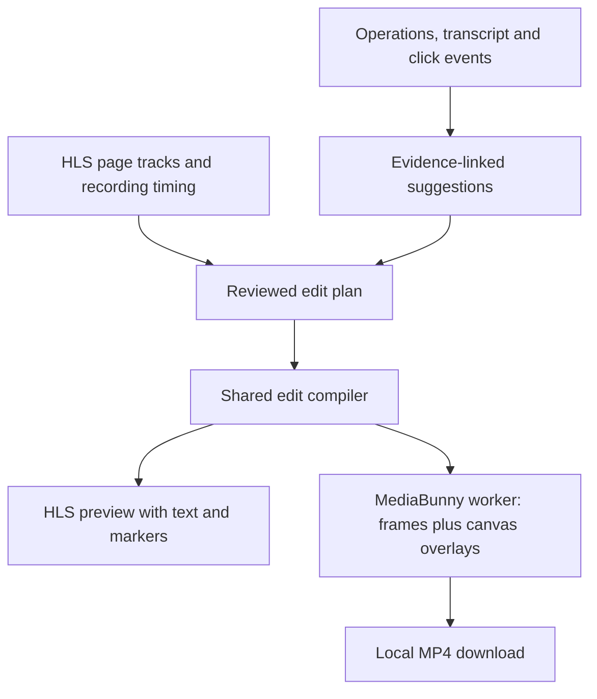

# Admin replay editing

Research date: 2026-09-05. Scout baseline: `611eb23`, v168, after rebasing onto
`origin/main`.

## Implemented click-export MVP

The admin chat replay now has **Show clicks**, a click-timing adjustment, and
**Export MP4**. Select a recorded tab to export that tab, or keep **Follow activity**
to export the session's matched tab sequence into one file. Download appears when
the render finishes. The export snapshots the current click settings.

The browser adapter records trusted, top-level pointer presses during agent and
manual-tool operations. Events contain the CDP tab ID, timestamp, and normalized
coordinates. Convex stores them alongside the operation, including failed
operations, and only returns replay data to the owning account. No prompt change
is needed. Existing recordings without click events cannot acquire real markers
retroactively. Human live-control intervals and iframe clicks are not captured.
New tabs attach asynchronously and mark the operation's coverage as partial.

MediaBunny 1.55.6 runs in a worker loaded on export. It reads fresh HLS playlists,
decodes frames, draws the video and click rings, and encodes one silent H.264 MP4
at 30 fps and original speed. Convex stores metadata and supplies authorized
playlists; it does not encode video. Export supports up to 50 minutes and 1 GiB,
closes decoders after each contiguous tab span, and supports cancellation.
The size ceiling leaves room for about 750 MB of video at the requested 2 Mbps
over 50 minutes, plus container overhead. The MP4 stays in memory until download;
these application limits do not guarantee enough memory on every device.
Closing or refreshing the replay cancels an active export. No video is uploaded.

Click times are calibrated from the browser clock to the operation clock, but
Firecrawl's recording origin remains approximate. The timing field shifts clicks
by up to 60 seconds in either direction. Unmatched click/tab associations are
reported and omitted; unresolved automatic video spans require explicit tab
selection. The overlay does not redact sensitive content already in the recording.
The current application-wide admin gate limits the pilot; add a separate
capability before opening the app to non-admin accounts.

Verification uses the existing Convex tests for owner isolation, validation, and
failed-operation persistence. A real Chromium proof records pointer clicks before
and after navigation, ignores synthetic events and iframe clicks, converts that
recording to HLS, exports through the actual worker, plays the resulting MP4, and
checks its decoded pixels for the rings. FFmpeg is used only to prepare and inspect
the verification recording, not by the application or its export path.

Run the standard gate with `pnpm run check` and the opt-in proof with
`node scripts/verify-replay-export.ts`. The proof requires FFmpeg and a matching
Playwright Chromium installation. An existing executable can be supplied as the
first argument, `node scripts/verify-replay-export.ts "/path/to/chromium"`.
It uses strict localhost port 5189, a separate dependency cache, and writes its
MP4, still frames, and capture report to a printed temporary directory.

The local HLS-to-MP4 proof passes. A new real Firecrawl session still needs to
verify signed-media CORS and source-clock alignment. Acceleration, captions, AI
highlight selection, and saved edits are future work described below.

## Proposed editor after the MVP

Add **Edit video** to the completed browser session in the chat's existing right
pane. Work on one selected session at a time. The editor shows the original replay,
an edited preview, and a short list of sections with source ranges, playback speeds,
and editable captions. **Suggest highlights** creates a draft that the administrator
can review. **Download MP4** renders the reviewed edit in a browser worker.

Use the same source-to-output timing model as Remotion Studio. Keep important
interactions at 1x and accelerate selected waits up to 16x. Lower the peak rate when
a section would otherwise be too short to understand or its caption too short to
read. Export uses MediaBunny frame sampling and canvas composition.

For the pilot, keep the draft in the chat workspace and download the MP4 locally.
Persisted edit revisions and uploaded videos can follow once the editing behavior
is useful. A refresh can discard an unsaved pilot draft. An export owns a fixed
snapshot of the edit and must survive inspector/session selection while the chat
workspace remains mounted. Leaving that workspace cancels and releases its worker.

## Existing integration points

- [Chat browser inspector][chat-browser]: `ChatBrowserView` already renders
  `BrowserReplay` for a closed session. This is the entry point for editor mode.
- [Session detail][session-detail]: the parent already loads operation IDs,
  `toolCallId`, action code, and outcomes. Replay separately fetches a reduced
  operation projection containing only sequence and state.
- [Playback controller][playback]: the player currently advances source time at
  1x. Merely setting the HTML video's playback rate will conflict with that clock
  and its periodic seek corrections. The controller must advance edited time and
  derive source time, active page, and rate from the shared edit compiler.
- [Stored transcript][chat-messages]: tool calls, results, and accessibility
  snapshots supply useful editorial evidence. Join operations through `toolCallId`.
  Model-input snapshots duplicate context and can contain compacted observations;
  they are not the primary editor input.
- [Access policy][access-policy]: there is no separate admin role or admin chat
  route. `ADMIN_ONLY` currently restricts the whole app through an email allowlist,
  with a configured development-seed exception. Session APIs additionally enforce
  chat ownership.

Expose a server-derived `canEditReplay` capability using the administrator allowlist
and configured development identity. Enforce it together with ownership and a
closed-session check in editor APIs. Keep this capability independent of
`ADMIN_ONLY`, so opening general sign-in later does not also expose the editor.
This does not require a general roles framework or access to other people's chats.

## What the editor can infer today

The stored transcript can explain the attempted action, observed page changes,
retries, tool errors, and verified account access. v168 also stores model-call
timings. Those are useful candidate planning intervals. They do not prove the
browser was idle while the model was running.

Fetch the selected session's evidence on the server rather than relying on the
currently loaded chat message page. The UI is paginated. Sessions are bounded at
500 operations, but reading the associated messages still needs bounded pagination
and an explicit incomplete-input result. A partial history must not silently
produce a supposedly complete edit.

There are no stored screenshots in this runtime. `snapshot()` calls
`ariaSnapshot()` and returns text. A later visual review stage could decode a sparse
storyboard from the HLS recordings. That would be a new input, not an existing
capability. A transcript-only draft cannot identify every visually interesting
moment or distinguish every loading animation from meaningful activity.

Useful default selection rules:

- Preserve an important action and enough of its visible result to understand it.
- Keep errors, the decision to retry, and the eventual result together.
- Preserve authentication changes, important navigation, human handoff boundaries,
  and the final visible state.
- Suggest compression for confirmed waiting and repeated inspection. A long tool
  call or an interval without observed clicks is not by itself confirmed waiting.
- Preserve unresolved outcomes. A timed-out browser request does not establish
  that the login failed.
- Treat assistant statements and action intent as claims until results support them.

For example, `record_authenticated_service_account` verifies visible identity and
a sign-out control. That can support a sign-in caption. Its `created` flag means
Scout inserted an account inventory record, not that the external service just
created a new account.

Human handoff records already include the session, turn, request, claim, and
continuation times. The human can interact throughout the control window, so the
whole window must not be treated as idle. Resuming a handoff closes the old browser;
joining the subsequent session into one film is a later extension.

## Prompt changes

The first manual editor requires no prompt changes. Automated suggestions need a
separate editor prompt that runs after a session closes and has no execution tools.
It receives the user's objective, candidate spans, related tool results, handoff
events, and outcome evidence. Its job is to select and describe those spans.

For future recordings, extend `browser_execute` with a short `intent` and an
activity hint. For example:

```json
{
  "intent": "Open the GitHub account menu",
  "activity": { "kind": "interact" },
  "code": "..."
}
```

Model activity as `interact`, `inspect`, or `wait` with a required visible
`condition` for a wait. The runtime validates and stores the metadata with the
operation. Manual tool examples need the same fields. These are intent hints, not
proof of success or proof that every millisecond of a call was idle.

The [browser tool description][tool-contract] already asks for one coherent step.
Add a short instruction to describe what the call attempts and to name the condition
for an explicit wait. A major rewrite of Scout's main prompt is unnecessary.
An instrumented wait helper could later emit real wait-start and wait-end events
inside a call, without adding a model round trip.

The editor model should select IDs supplied by the server rather than invent video
timestamps. A proposed contract is:

```text
Candidate span
  id, operationIds, toolCallIds
  timing: aligned source range | unaligned observed server range
  activity evidence, outcome evidence, required context

Editor draft
  decisions: spanId, keep | compress | omit, evidenceIds, explanation
  captions: spanIds, text, intent | observed_result, evidenceIds
  unresolved: spanId, reason
```

The server validates referenced IDs and attaches an input revision and prompt/model
version. The compiler owns ranges, ordering, speed limits, and reading time. Model
confidence must not override unresolved timing or track identity. Omission remains
visible in the section list, and errors or handoffs cannot be silently removed by
the suggestion stage.

## Timing and track identity need work

[Firecrawl's replay controller][firecrawl-replay] defines page start/end times as
milliseconds from session start, and `pageUrl` as the first URL recorded for that
tab. Scout's current observations instead use `Date.now()` in the Convex Node
process. The [timeline builder][timeline] independently subtracts the first
telemetry timestamp and the first retained recording start. That does not calibrate
the clocks. Current activity following is approximate.

Keep these times distinct in the proposed model:

1. Browser event time, with document identity and clock calibration evidence.
2. Original recording time, shared across that session's page tracks.
3. Edited output time, shared by preview, text, markers, and export.

The pilot should support an administrator-reviewed timing offset and explicit page
track choices. Use an alignment state such as `unresolved`, `manual`, or
`provider_verified`, and retain the supporting evidence and uncertainty. Existing
recordings can be edited directly in source-video time even when their operation
alignment is unresolved. Exact automatic click placement cannot use an unresolved
alignment.

MediaBunny can use HLS `EXT-X-PROGRAM-DATE-TIME` to map media timestamps to Unix time.
Whether Firecrawl supplies it in our actual playlists remains untested. If present,
verify it against browser events before using it as the recording anchor. Otherwise
the administrator's calibration remains necessary until a provider recording-clock
mapping is available. The API's session creation timestamp alone is not a proven
recording origin. See [MediaBunny HLS timing][mediabunny-hls].

Chromium target IDs also differ from Firecrawl's numeric recording page IDs. Current
replay binds them by uniquely matching URLs. Duplicate login URLs can remain
ambiguous. Retain that uncertainty and allow a reviewed override. An export must
not guess which account's tab to show.

## Restore clicks as runtime evidence

The old markers were removed in `63c3be6`, "Replace browser DSL with Playwright
execution", shipped with PR #47 in `d80c3e9`. The old implementation measured an
element's box before dispatch and showed its center for 700 ms. It did not record
the actual click event.

Use the existing CDP connection in `ConnectedPlaywrightBrowser.initialize()` for
new capture. Install an idempotent document listener and a context binding, both
for current documents and future page/frame navigations. Playwright documents
[init scripts][playwright-init] and [binding page/frame identity][playwright-binding].

Record trusted pointer-down events with session ID, operation association, event
sequence, tab/document identity, browser timestamp, viewport dimensions, and
coordinates. A pointer-down records a press, not a successful resulting action.
No target text, input values, or raw page HTML is needed. Keyboard activation and
password `.fill()` should not produce an invented click marker.

Begin with top-level viewport coordinates. For child frames, preserve the event
as unmapped until coordinate conversion is verified against borders, scrolling,
transforms, and navigation races. Do not draw a guessed ring. Scale mapped CSS
coordinates using the video's actual displayed rectangle, including letterboxing.

Keep events and capture coverage independently of the operation outcome. Drain
pending capture at operation/slice completion, retain collected events on failure,
and report truncation if the bounded buffer fills. An empty buffer only means no
clicks were observed within its known coverage.

There is a related [failure-state gap][failure-state]: several execution paths
already know before/dispatch/return times, then discard them when persisting an
indeterminate result. Preserve partial observations honestly on those paths. Error
and recovery sections are important editorial evidence.

A local lifecycle probe used `playwright-core@1.62.1` and cached Chromium headless
shell revision 1232. A second Playwright client attached to the temporary browser
over CDP and installed an init script, binding, and pointer listener:

| Stage                                 | In-page pointer count | Received binding callbacks |
| ------------------------------------- | --------------------: | -------------------------: |
| Connected                             |                     1 |                          1 |
| Recorder disconnected, same document  |                     2 |                          1 |
| Navigation while disconnected         |       Listener absent |                          1 |
| Reconnect without reinstalling script |       Listener absent |                          1 |

Reinstall on each attachment and explicitly dispose the recorder connection and
listeners at the appropriate slice boundary. v168 creates a fresh harness for each
model slice while preserving the provider browser. A one-time installation cannot
provide continuous capture. Human-control intervals outside a connected recorder
must show unavailable click coverage. Complete capture there would require a
recorder whose lifetime matches the browser session; it is not a pilot requirement.

This was a local browser probe, not a Firecrawl capture test. Existing recordings
without click events cannot recover precise coordinates from their transcripts.

## Shared preview and export



The plan uses source ranges and explicit track choices. Derived output positions
should not become a second independently editable timing source. Compile a mapping
from each output frame to source time. At 30 fps and 16x, successive output frames
sample source moments about 533 ms apart. The output still plays at 30 fps. Export
does not use the HTML media element's playback-rate setting and needs no 24x proxy.

Retain the current HLS player for preview, driven by edited time and the current
rate. Use a React overlay for captions and click rings. A shared overlay layout
routine should supply positions, line breaks, and style values to both React and
Canvas. Wait for the export font to load so wrapping is consistent. Protect brief
1x context around important clicks and page transitions. That also keeps a click
ring visible without leaving it over a different page during acceleration.

Load MediaBunny when export starts. If thumbnails or a visual storyboard are added,
those features can load the same worker on demand. The media path is:

1. Request fresh playlists through the existing authorized Convex actions.
2. Create one HLS input per required page. Use a `CustomPathedSource` because Scout
   receives playlist text, and resolve referenced media through URL sources.
3. Resolve source media timestamps, select the proper page, and use
   `VideoSampleSink.samplesAtTimestamps` to get the required frames.
4. Draw each frame and its text/markers on an `OffscreenCanvas`.
5. Await `CanvasSource.add(outputTime, frameDuration)`, then finalize the MP4.

[HLS input][mediabunny-hls], [frame sampling][mediabunny-sinks], and
[canvas encoding][mediabunny-canvas] are documented MediaBunny capabilities. The
first version can export silent screen video, matching the current muted player.
Preserving or retiming source audio is a separate feature.

Check decoder/AVC encoder support for the requested dimensions before starting.
Bound active decoders, close samples promptly, and dispose inputs on cancellation.
The current `BufferTarget` holds the MP4 in memory. Its documentation recommends
it for files below roughly 100 MB, so the 1 GiB application ceiling can exceed
that recommendation. Streaming to a seekable file target, respecting write offsets,
remains the next step if real session exports hit memory pressure.
A 16x edit does not guarantee a 16x faster render
because dependent source frames may still need decoding. See
[codec checks][mediabunny-codecs] and [output targets][mediabunny-output].

Firecrawl's current source says segment links expire after approximately six
hours and requesting the playlist renews them. The replay endpoints remain an
undocumented provider boundary. Refresh playlists for export and test actual
segment CORS, timestamps, and decoding before calling the integration verified.

## Proposed implementation units

| Files or area                                                                   | Responsibility                                                             |
| ------------------------------------------------------------------------------- | -------------------------------------------------------------------------- |
| `convex/access.ts`, `convex/authConfig.ts`                                      | Editor capability, independent of general app admission.                   |
| `convex/scout/playwrightBrowser.ts`, new `browserRecorder.ts`                   | Scoped event capture, clock samples, coverage, cleanup.                    |
| `convex/browserModel.ts`, `convex/scout/browserSessions.ts`, `convex/schema.ts` | Partial failure evidence and bounded persisted browser events.             |
| `convex/scout/browserTools.ts`, `browserToolContract.ts`                        | Intent/activity hints and recorder lifecycle around operations.            |
| New `convex/replayEditing.ts`                                                   | Authorized session evidence, candidate spans, structured draft generation. |
| New `shared/replayEdit.ts`                                                      | Plan contract, range validation, speed curves, output/source mapping.      |
| `src/routes/chats.tsx`, new `src/components/replay-editor.tsx`                  | Editor entry, section review, track/offset controls, export ownership.     |
| `src/components/browser-replay.tsx`, `src/lib/browserReplayTimeline.ts`         | Edited preview clock, playback rate, explicit recording alignment.         |
| New `src/lib/replayExport.worker.ts`, `src/lib/replayOverlay.ts`                | HLS frame composition, shared overlay layout, MP4 generation.              |

Build in verifiable increments:

1. Test a real completed Firecrawl replay through MediaBunny, including a two-tab
   sample, and establish how its media timestamps align. The result should be a
   playable MP4 with a correctly placed test caption.
2. Restore scoped pointer capture, retain failure timing, and add the small
   intent/activity metadata so new sessions accumulate better evidence. Confirm
   known clicks against video frames near both the start and end of a recording.
3. Add the admin editor, manual source ranges and captions, speed limits, alignment
   overrides, and download. Existing recordings can use this without new telemetry.
4. Add **Suggest highlights** using evidence-linked spans and a separate editor
   prompt. Review the draft in the same editor. Add persisted plans and uploaded
   outputs only after the pilot proves useful.

Acceptance checks should cover caption readability, source coverage through speed
ramps, real click alignment, duplicate-URL tabs, failure/retry preservation,
navigation during capture, reconnects, cancellation, and capability plus ownership
boundaries. Human capture gaps and unmapped iframe events must remain visible to
the reviewer. A saved or shared video later needs review of its actual pixels;
sanitized captions do not redact the provider recording.

## Verification completed for this research

- Rebased from v167 to `origin/main` v168 without conflicts.
- Ran `vp install` and `pnpm run check`: formatting, lint, browser/Node/Convex
  TypeScript, 44 test files / 329 tests, and dev-launcher validation passed.
- Inspected the current chat, runtime, prompts, replay code, and click removal history.
- Ran the local recorder lifecycle probe described above.
- Checked current primary MediaBunny, Firecrawl, and Playwright sources.
- Did not render a real Firecrawl recording, change runtime prompts, or implement
  the editor. Only this research document was added.

[chat-browser]: https://github.com/samebase/scout/blob/611eb2349b2dc98520ed5e5ad3abd399ad43cd3d/src/routes/chats.tsx#L1196
[session-detail]: https://github.com/samebase/scout/blob/611eb2349b2dc98520ed5e5ad3abd399ad43cd3d/convex/scout/browserSessions.ts#L141
[playback]: https://github.com/samebase/scout/blob/611eb2349b2dc98520ed5e5ad3abd399ad43cd3d/src/components/browser-replay.tsx#L212
[chat-messages]: https://github.com/samebase/scout/blob/611eb2349b2dc98520ed5e5ad3abd399ad43cd3d/convex/scout/chats.ts#L381
[access-policy]: https://github.com/samebase/scout/blob/611eb2349b2dc98520ed5e5ad3abd399ad43cd3d/convex/access.ts#L9
[tool-contract]: https://github.com/samebase/scout/blob/611eb2349b2dc98520ed5e5ad3abd399ad43cd3d/convex/scout/browserToolContract.ts#L15
[timeline]: https://github.com/samebase/scout/blob/611eb2349b2dc98520ed5e5ad3abd399ad43cd3d/src/lib/browserReplayTimeline.ts#L112
[failure-state]: https://github.com/samebase/scout/blob/611eb2349b2dc98520ed5e5ad3abd399ad43cd3d/convex/browserModel.ts#L39
[firecrawl-replay]: https://github.com/firecrawl/firecrawl/blob/main/apps/api/src/controllers/v2/browser-replay.ts
[playwright-init]: https://playwright.dev/docs/api/class-browsercontext#browser-context-add-init-script
[playwright-binding]: https://playwright.dev/docs/api/class-browsercontext#browser-context-expose-binding
[mediabunny-hls]: https://mediabunny.dev/guide/reading-hls
[mediabunny-sinks]: https://mediabunny.dev/guide/media-sinks
[mediabunny-canvas]: https://mediabunny.dev/api/CanvasSource
[mediabunny-codecs]: https://mediabunny.dev/guide/supported-formats-and-codecs
[mediabunny-output]: https://mediabunny.dev/guide/writing-media-files
